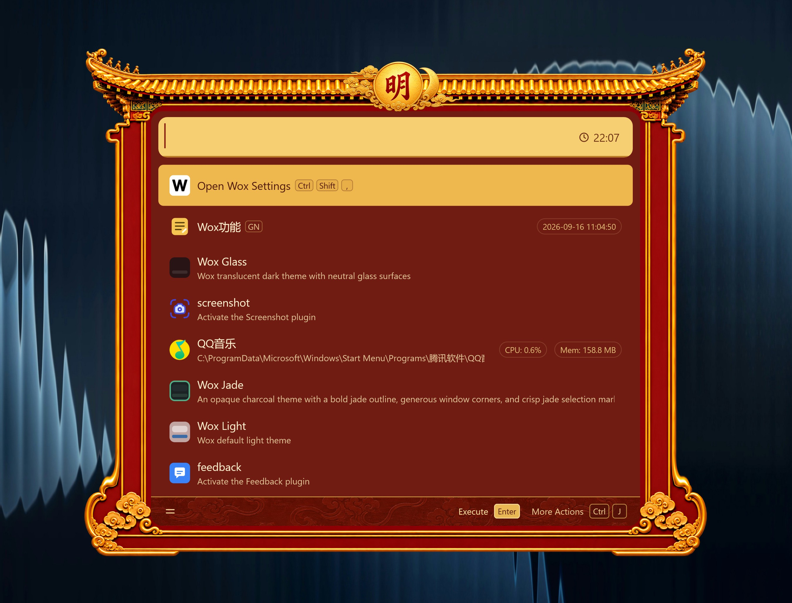

# 明 · Ming

A Wox theme inspired by the Ming dynasty, with golden palace eaves, vermilion lacquer, cloud ornaments, and a sun-and-moon crest.

以明朝皇家建筑为灵感的 Wox 主题：金瓦飞檐、朱漆立柱、祥云纹饰与日月徽章。

## Requirements / 版本要求

**Wox v2.4.5 or later / Wox v2.4.5 及以上。**